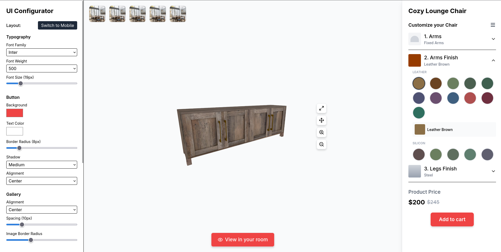
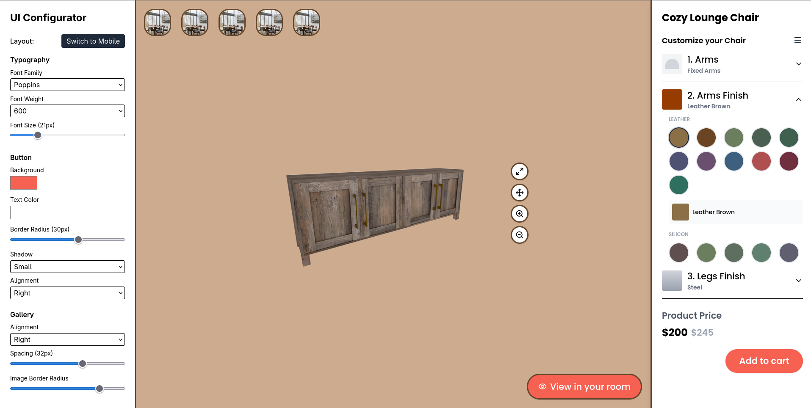
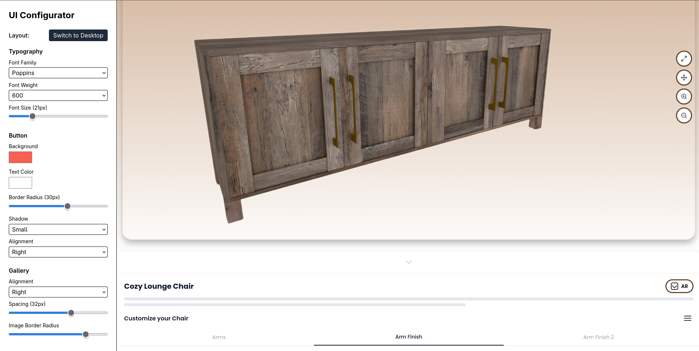

# 🎨 Furniture Customizer - Live UI Configuration Tool

A powerful React-based furniture product customizer with a real-time visual configuration panel. This application allows you to design and customize furniture products with live preview across desktop and mobile layouts.<br/>
<br/>
**[View Live Demo on Vercel](https://dynamic-ui-editor-three.vercel.app/)**
<br/>



# Changes in UI



## 🌟 Features

### Live Configuration Panel
- **Typography Controls**: Change font family, weight, and size in real-time
- **Button Customization**: Adjust colors, border radius, shadows, and alignment
- **Gallery Settings**: Control image spacing, border radius, and alignment
- **Border Styling**: Customize border colors and widths
- **General Layout**: Modify card radius, padding, and background colors
- **Export Configuration**: Download your design as a JSON file

### Dual Layout Support
- **Desktop Layout**: Full-featured furniture customizer with thumbnail gallery and 3D controls
- **Mobile Layout**: Optimized mobile interface with touch-friendly controls and AR preview button
- **Seamless Switching**: Toggle between desktop and mobile views instantly

### Product Customization
- **Material Selection**: Choose from leather and silicon finishes
- **Color Options**: Wide range of colors for arms, legs, and body
- **Interactive Preview**: Real-time product updates as you customize
- **3D Controls**: Zoom, rotate, maximize, and move views

## 📋 Table of Contents

- [Installation](#installation)
- [Project Structure](#project-structure)
- [Usage](#usage)
- [Configuration](#configuration)
- [Components Overview](#components-overview)
- [Customization](#customization)
- [Technologies Used](#technologies-used)
- [Contributing](#contributing)
- [License](#license)

## 🚀 Installation

### Prerequisites
- Node.js (v14 or higher)
- npm or yarn

### Setup

1. **Clone the repository**
```bash
git clone https://github.com/Japneets16/Dynamic-UI-Editor.git
```

2. **Install dependencies**
```bash
npm install
# or
yarn install
```

3. **Start the development server**
```bash
npm start
# or
yarn start
```

4. **Open your browser**
Navigate to`http://localhost:5173/`

## 📁 Project Structure

```
src/
├── App.js                          # Main application component
├── index.js                        # Application entry point
│
├── context/
│   └── ConfigContext.js            # Global configuration state management
│
├── components/
│   ├── FontLoader.js               # Dynamic Google Fonts loader
│   ├── EditorPanel.js              # Configuration sidebar with all controls
│   ├── LayoutSwitcher.js           # Desktop/Mobile layout toggle
│   ├── PreviewComponent.js         # Layout renderer (Desktop/Mobile)
│   │
│   └── layouts/
│       ├── DesktopLayout.js        # Desktop furniture customizer view
│       ├── MobileLayout.js         # Mobile furniture customizer view
│       │
│       └── images/
│           ├── product.png         # Main product image
│           ├── 1.jpg              # Thumbnail images
│           └── ...
```

## 💡 Usage

### Basic Workflow

1. **Launch the Application**
   - The app opens with the desktop layout by default
   - Left sidebar shows all configuration controls
   - Right side displays the live preview

2. **Customize the Design**
   - Adjust typography settings (font, size, weight)
   - Modify button styles (colors, shadows, alignment)
   - Change gallery and border properties
   - Update general layout settings

3. **Switch Layouts**
   - Use the "Switch to Mobile" button to preview mobile design
   - All changes apply to both layouts in real-time

4. **Customize the Product**
   - Select arm styles and finishes
   - Choose from leather or silicon materials
   - Pick from various color options
   - Adjust leg finishes

5. **Export Your Configuration**
   - Click "Export JSON" to download your design settings
   - Import the JSON later to restore your configuration

### Example: Changing Button Style

```javascript
// The configuration is automatically managed through the UI
// But here's how it works under the hood:

const config = {
  button: {
    bgColor: "#ef4444",      // Red background
    textColor: "#ffffff",     // White text
    borderRadius: "8px",      // Rounded corners
    shadow: "md",             // Medium shadow
    align: "center"           // Centered alignment
  }
}
```

## ⚙️ Configuration

### Default Configuration Object

The application uses a centralized configuration object defined in `ConfigContext.js`:

```javascript
{
  typography: {
    fontFamily: "Inter",           // Font family from Google Fonts
    fontWeight: 500,               // Font weight (400-700)
    fontSize: 16,                  // Font size in pixels
  },
  button: {
    bgColor: "#ef4444",            // Background color (hex)
    textColor: "#ffffff",          // Text color (hex)
    borderRadius: "8px",           // Border radius
    shadow: "md",                  // Shadow size: none|sm|md|lg
    align: "center",               // Alignment: left|center|right
  },
  gallery: {
    alignment: "center",           // Image alignment
    spacing: 10,                   // Space between images (px)
    borderRadius: 10,              // Image border radius (px)
  },
  general: {
    cardRadius: 16,                // Card border radius (px)
    padding: 20,                   // General padding (px)
    backgroundColor: "#f9fafb",    // Page background color
    panelBg: "#ffffff",            // Panel background (mobile)
    shadow: "md",                  // General shadow level
  },
  border: {
    color: "#e5e7eb",              // Border color (hex)
    width: 1,                      // Border width (px)
  },
  layout: "desktop"                // Current layout: desktop|mobile
}
```

### Available Font Families

- Inter
- Roboto
- Poppins
- Open Sans
- Montserrat
- Lato
- Raleway
- Playfair Display
- Merriweather

### Shadow Options

- `none`: No shadow
- `sm`: Small shadow (0 1px 2px rgba(0,0,0,0.1))
- `md`: Medium shadow (0 4px 6px rgba(0,0,0,0.15))
- `lg`: Large shadow (0 10px 15px rgba(0,0,0,0.25))

## 🧩 Components Overview

### Core Components

#### **App.js**
Main application wrapper that provides the ConfigContext and layout structure.

```javascript
<ConfigProvider>
  <FontLoader />
  <EditorPanel />
  <LayoutSwitcher />
  <PreviewComponent />
</ConfigProvider>
```

#### **ConfigContext.js**
Global state management using React Context API. Provides configuration to all child components.

**Key Functions:**
- `useConfig()`: Hook to access and modify configuration
- `setConfig()`: Update configuration state

#### **FontLoader.js**
Dynamically loads Google Fonts based on selected font family. Automatically updates when font changes.

#### **EditorPanel.js**
Configuration sidebar with all customization controls:
- Typography controls
- Button styling
- Gallery settings
- Border customization
- General layout options
- Export JSON functionality

#### **LayoutSwitcher.js**
Simple toggle button to switch between desktop and mobile layouts.

#### **PreviewComponent.js**
Conditional renderer that displays either DesktopLayout or MobileLayout based on current configuration.

### Layout Components

#### **DesktopLayout.js**
Full desktop furniture customizer interface featuring:
- Thumbnail gallery strip
- Large product image with 3D controls
- Expandable customization panel
- Material and color selection
- Price display
- Add to cart button

#### **MobileLayout.js**
Mobile-optimized interface featuring:
- Collapsible customization panel
- Touch-friendly color selectors
- AR preview button
- Tab navigation for options
- Responsive design

## 🎨 Customization

### Adding New Fonts

1. Add font option to EditorPanel.js:
```javascript
<option value="Your Font Name">Your Font Name</option>
```

2. The FontLoader component will automatically load it from Google Fonts

### Adding New Configuration Options

1. Update ConfigContext.js:
```javascript
const [config, setConfig] = useState({
  // ... existing config
  yourNewSection: {
    yourProperty: "defaultValue"
  }
});
```

2. Add controls in EditorPanel.js:
```javascript
<section>
  <h2 className="font-semibold mb-2">Your New Section</h2>
  <input
    type="text"
    value={config.yourNewSection.yourProperty}
    onChange={(e) => updateConfig("yourNewSection", "yourProperty", e.target.value)}
  />
</section>
```

3. Apply in layout components:
```javascript
<div style={{ yourCssProperty: config.yourNewSection.yourProperty }}>
  {/* Your content */}
</div>
```

### Modifying Product Options

Edit the color arrays in DesktopLayout.js or MobileLayout.js:

```javascript
const leatherColors = [
  { name: "Your Color Name", color: "#hexcode" },
  // Add more colors...
];
```

## 🛠️ Technologies Used

- **React 18.x** - UI library
- **React Context API** - State management
- **Lucide React** - Icon library
- **Google Fonts API** - Dynamic font loading
- **CSS3** - Styling
- **JavaScript ES6+** - Core programming

## 📦 Dependencies

```json
{
  "react": "^18.0.0",
  "react-dom": "^18.0.0",
  "lucide-react": "^0.263.1"
}
```

## 🤝 Contributing

We welcome contributions! Please follow these steps:

1. Fork the repository
2. Create a feature branch (`git checkout -b feature/AmazingFeature`)
3. Commit your changes (`git commit -m 'Add some AmazingFeature'`)
4. Push to the branch (`git push origin feature/AmazingFeature`)
5. Open a Pull Request

### Contribution Guidelines

- Follow existing code style
- Add comments for complex logic
- Test your changes in both desktop and mobile layouts
- Update README if adding new features

## 🙏 Acknowledgments

- Icons provided by [Lucide React](https://lucide.dev/)
- Fonts from [Google Fonts](https://fonts.google.com/)
- Inspiration from modern e-commerce product customizers
